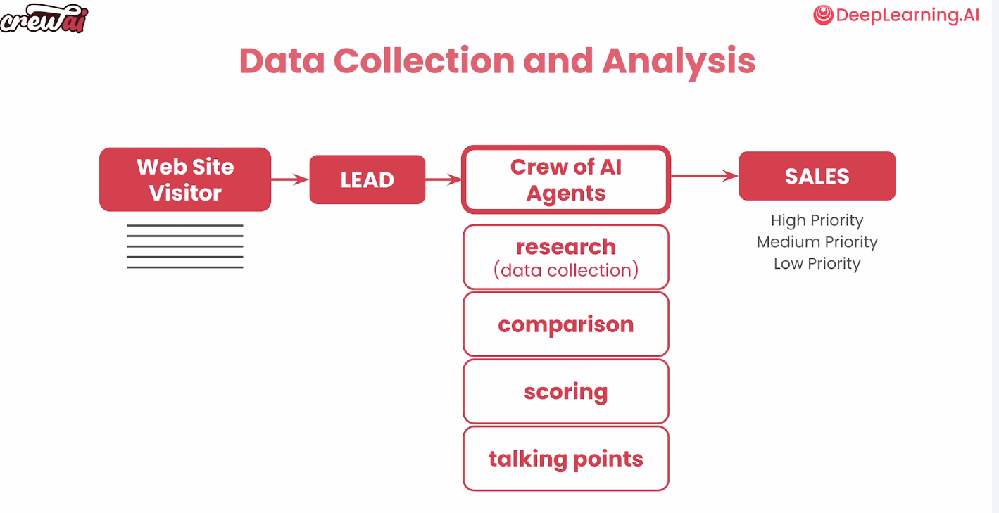
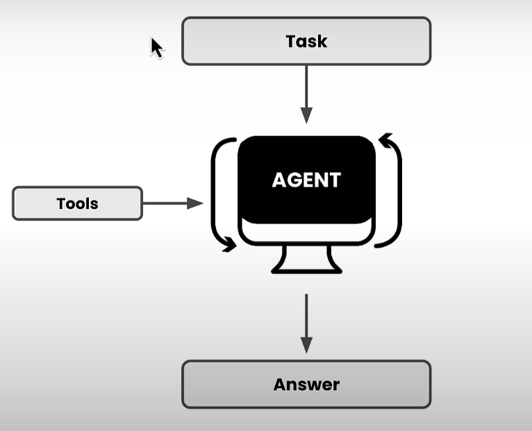

# Multi AI Agent Systems with crewAI

## Introduction

Ejemplo: Sistema multiagente para conseguir y preparar entrevistas de trabajo IT.

### ¿Qué es la Automatizacion mediante agentes?

La automatización determinista tradicional consiste en la evaluación de una serie de reglas que tiende a complicarse conforme se añaden condiciones.
La automatización mediante IA simplemente añade las reglas y deja a la IA subyacente que las aplique.
El uso de agentes IA ayuda a separar responsabilidades y, por tanto, poder definir mejor cómo se afronta cada tarea.

#### Diferencias entre el desarrollo tradicional y el desarrollo AI

| | Desarrollo Tradicional | Desarrollo AI |
|:--|:--|:--|
| Entradas| Conocimiento claro de los inputs a priori | **Entradas difusas**: las desconocemos a priori|
| Transformaciones | Cálculos matemáticos, flujos deterministas y controlados | **Transformaciones difusas**: no sabemos exactamente que hará el LLM |
| Salidas | Conocimiento claro de la salida esperada | **Salidas difusas**: el resultado obtenido puede adoptar múltiples formatos |
| Notas | El comportamiento puede ser replicado | Al ser un modelo **probabilistico** cada vez puede ser diferente|

### Ejemplos de aplicaciones

#### Recopilación y análisis de datos

En la **aproximación tradicional** se aplican una serie de reglas a posibles clientes que han conectado con una empresa a través de su formulario de contacto para realizarles ofertas.

En la **aproximación mediante agentes IA** se puede tener un grupo de agentes que **investiguen** (research) sobre los potenciales clientes, los comparen con los clientes actuales (comparation), los puntuen (scoring) y determinen qué temas les pueden interesar (talking points)



## AI Agents

La experiencia con los chat de AI exige la iteracción continua del usuario para afinar los resultados.

En el caso de los agentes las preguntas y respuestas se las puede hacer el mismo para optimizar la respuestas. Esto permite asignarle una **tarea**.

Los agentes disponen de **Herramientas / Habilidades** que les permiten interactuar con su entorno: llamadas a APIs, consultas a BBDDs, busquedas en la web, etc.


### Sistemas Multi-Agente

Varios agentes en el sistema, que pueden asignarse tareas entre ellos.

#### Beneficios

- Asignación de responsabilidades
- Cada agente puede ejecutarse en un LLM diferente.

### CrewAI

Es un framework y plataforma para la definición y orquestación de agentes AI.

- permite dividir estos conceptos en estructuras simples.
- proporciona un patrón para unir estos sistemas.
- proporciona herramientas/habilidades para el uso de agentes.
- proporciona un modelo para construir herramientas o agentes personalizados.

#### Bloques iniciales de crewAI

- Agentes
- Tareas
- Crews

## Crear agentes para investigar y escribir un artículo (codigo)

### Contexto

Se va a crear un sistema con 3 agentes para escribir artículos para un blog sobre cualquier tópico.
Se dispondrá de un Investigador, un Escritor y un Editor con responsabilidades separadas.

Será necesario crear los agentes, las tareas y los bloques.

```python
# Warning control
import warnings
warnings.filterwarnings('ignore')

from crewai import Agent, Task, Crew

import os
from utils import get_openai_api_key

openai_api_key = get_openai_api_key()
os.environ["OPENAI_MODEL_NAME"] = 'gpt-3.5-turbo'
# también podríamos usar modelos locales
```

### Creación de los agentes

Cada agente debe tener definidos los siguientes atributos:

- **role** : el rol que desempeñará el agente
- **goal**: objetivo del agente
- **backstory** es el trasfondo/contexto para el agente.

y opcionalmente

- **allow_delegation**: informa si el agente puede o no delegar trabajo en otros agentes.
- **verbose**: (True | False) indicará si el agente nos informa de su proceso de razonamiento.

#### Agente Investigador

```python
planner = Agent(
    role="Content Planner",
    goal="Plan engaging and factually accurate content on {topic}",
    backstory="You're working on planning a blog article "
              "about the topic: {topic}."
              "You collect information that helps the "
              "audience learn something "
              "and make informed decisions. "
              "Your work is the basis for "
              "the Content Writer to write an article on this topic.",
    allow_delegation=False,
    verbose=True
)
```

### Agente Escritor

```python
writer = Agent(
    role="Content Writer",
    goal="Write insightful and factually accurate "
         "opinion piece about the topic: {topic}",
    backstory="You're working on a writing "
              "a new opinion piece about the topic: {topic}. "
              "You base your writing on the work of "
              "the Content Planner, who provides an outline "
              "and relevant context about the topic. "
              "You follow the main objectives and "
              "direction of the outline, "
              "as provide by the Content Planner. "
              "You also provide objective and impartial insights "
              "and back them up with information "
              "provide by the Content Planner. "
              "You acknowledge in your opinion piece "
              "when your statements are opinions "
              "as opposed to objective statements.",
    allow_delegation=False,
    verbose=True
)
```

### Agente Editor

Es el responsable de revisar el contenido creado

```python
editor = Agent(
    role="Editor",
    goal="Edit a given blog post to align with "
         "the writing style of the organization. ",
    backstory="You are an editor who receives a blog post "
              "from the Content Writer. "
              "Your goal is to review the blog post "
              "to ensure that it follows journalistic best practices,"
              "provides balanced viewpoints "
              "when providing opinions or assertions, "
              "and also avoids major controversial topics "
              "or opinions when possible.",
    allow_delegation=False,
    verbose=True
)
```

### Creación de las Tareas

Las tareas deben presentar los siguientes atributos:

- **description**: especifica con más detalle qué y cómo se quiere que haga la tarea.Son las "instrucciones" detalladas que le damos al agente.
- **expected_output**: la salida esperada de la tarea. Actua cómo una función *de fuerza* para obligarte a pensar, con precisión, qué quieres obtener.
- **agent**: el agente al que está asignada

#### Tarea Planificar/Investigar

```python
plan = Task(
    description=(
        "1. Prioritize the latest trends, key players, "
            "and noteworthy news on {topic}.\n"
        "2. Identify the target audience, considering "
            "their interests and pain points.\n"
        "3. Develop a detailed content outline including "
            "an introduction, key points, and a call to action.\n"
        "4. Include SEO keywords and relevant data or sources."
    ),
    expected_output="A comprehensive content plan document "
        "with an outline, audience analysis, "
        "SEO keywords, and resources.",
    agent=planner,
)
```

#### Tarea Escribir

```python
write = Task(
    description=(
        "1. Use the content plan to craft a compelling "
            "blog post on {topic}.\n"
        "2. Incorporate SEO keywords naturally.\n"
        "3. Sections/Subtitles are properly named "
            "in an engaging manner.\n"
        "4. Ensure the post is structured with an "
            "engaging introduction, insightful body, "
            "and a summarizing conclusion.\n"
        "5. Proofread for grammatical errors and "
            "alignment with the brand's voice.\n"
    ),
    expected_output="A well-written blog post "
        "in markdown format, ready for publication, "
        "each section should have 2 or 3 paragraphs.",
    agent=writer,
)
```

#### Tarea Editar

```python
edit = Task(
    description=("Proofread the given blog post for "
                 "grammatical errors and "
                 "alignment with the brand's voice."),
    expected_output="A well-written blog post in markdown format, "
                    "ready for publication, "
                    "each section should have 2 or 3 paragraphs.",
    agent=editor
)
```

### Creación del Grupo

El equipo une agentes y tareas para que puedan actuar como una unidad.

- Se crea el grupo de agentes.
- Se le pasan las tareas que deben ser realizadas.
  - en este caso se trata de una ejecución secuencial por lo que el orden es importante
- *verbose=2* permite ver los logs de ejecución

```python
crew = Crew(
    agents=[planner, writer, editor],
    tasks=[plan, write, edit],
    verbose=2
)
```

### Ejecutar el grupo

```python
result = crew.kickoff(inputs={"topic": "Artificial Intelligence"})
# mostramos el resultado obtenido
from IPython.display import Markdown
Markdown(result)
```

### Usar otros modelos de LLM populares

En el ejemplo se ha forzado el uso de 'gpt-3.5-turbo', el LLM por defecto es 'gpt-4', pero pueden usarse otros. 

#### Hugging Face

```python
from langchain_community.llms import HuggingFaceHub

llm = HuggingFaceHub(
    repo_id="HuggingFaceH4/zephyr-7b-beta",
    huggingfacehub_api_token="<HF_TOKEN_HERE>",
    task="text-generation",
)

### you will pass "llm" to your agent function
```

#### Mistral API

```python
OPENAI_API_KEY=your-mistral-api-key
OPENAI_API_BASE=https://api.mistral.ai/v1
OPENAI_MODEL_NAME="mistral-small"
```

#### Cohere

```python
from langchain_community.chat_models import ChatCohere
# Initialize language model
os.environ["COHERE_API_KEY"] = "your-cohere-api-key"
llm = ChatCohere()

### you will pass "llm" to your agent function
```

### Uso de otras LLMs o LLMs en local

<https://docs.crewai.com/how-to/LLM-Connections/>

### Recomendaciones

- Los agentes funcionan mejor cuando tienen un rol bien definido.
- Debe centrarse el foco en objetivos y expectativas
- Un agente puede realizar multiples tareas
- Los agentes y tareas deberían ser **granulares**.
- Las tareas se pueden ejecutar de diferentes formas (secuencial, parale)

## Key Elements of AI agents

### Elementos de un buen agente

- Role Playing
- Enfoque
- Herramientas
- Cooperación
- Salvaguardas
- Memoria

### Role Playing

- El rol informa al agente del contexto en el que tiene que realizar su tarea.
- En el ejemplo asigna el rol "agente financiero certificado por FINRA" lo que tiene incidencia en cómo recupera información del RAG LLM.

### Enfoque

Cuando en un prompt se proporciona mucha información, muchas herramientas, etc.,  damos paso a generar confusión sobre lo que se pretende lograr.

La especialización del agente permite delimitar claramente su responsabilidad, evitando *derivas*.

### Herramientas

Las herramientas son los conectores del agente con el entorno. P.ej. consultas en la web, ejecución de scripts python, consultas a bbdd, invocación de servicios, etc.

Proporcionar demasiadas herramientas genera confusión, el sistema puede no saber cual es la herramienta adecuada en cada momento.

### Cooperación

- Realimentación
- Delegación de tareas

### Salvaguardas (Guardrails)

El uso de entradas, transformaciones y salidas difusas genera la posibilidad de bloqueos en un entorno multiagente, habitualmente en el acceso a las herramientas, o alucinaciones.
El framework y/o la plataforma deben proporcionar funcionalidad para evitarlo.

### Memoria

Es la capacidad del agente para recordar lo que ha hecho en el pasado, aprender de ello y usarlo, en vez de que cada ejecución dependa exclusivamente de los datos proporcionados.
**CrewAI** proporciona 3 tipos de memoria:
    - Memoria a largo plazo (Long-term memory)
    - Memoria a corto plazo (Short-term memory)
    - Memoria de entidad (Entity Memory)

El uso combinado de estos tres tipos de memoria permite que los resultados sean cada vez más precisos y consistentes a lo largo de multiples ejecuciones.

#### Memoria a corto plazo

- Se reinicia con cada nueva ejecución de una tarea.
- Es compartida entre todos los agentes del grupo.

#### Memoria a largo plazo (Long-term memory)

- se almacena en una base de datos local.
- permite a los agentes aprender de ejecuciones anteriores.
- ayuda a los agentes a autoevaluarse.

#### Memoria de entidad (Entity Memory)

- es de corta duración
- almacena **que son** los sujetos sobre los que se está trabajando( personas, organizaciones, etc.)

